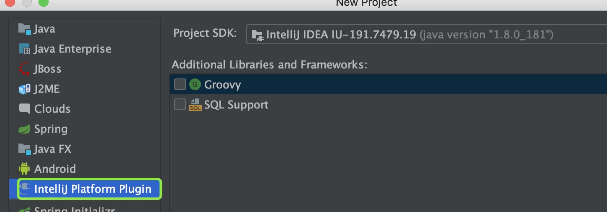
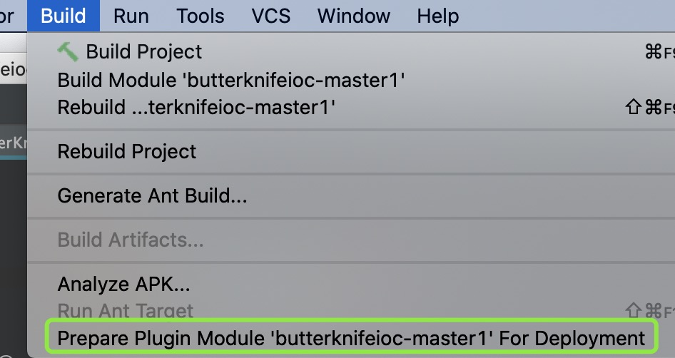
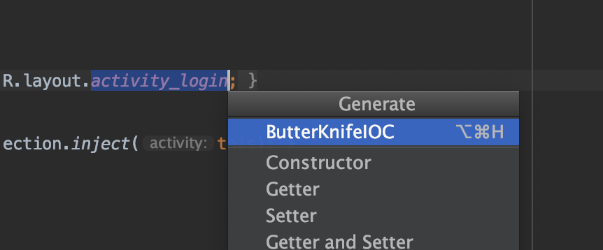
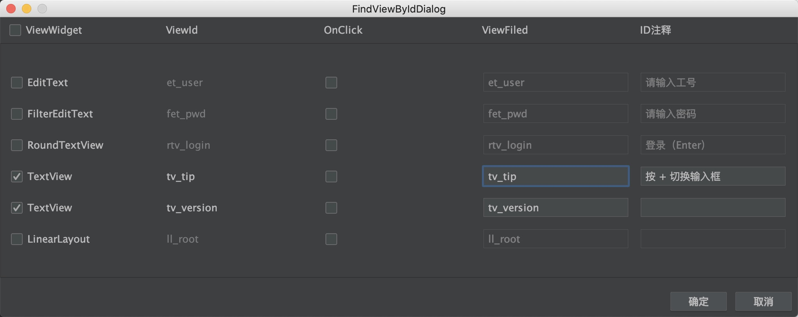

插件研究

自己写的一个超简单的Android视图的字段和方法绑定。基于次篇章，你可以快速的制作或者修改成任何自己想要的Android视图的字段和方法绑定。

此版本是给Butterknife使用的，如果还有人使用xutils框架，需要给以前的xutils框架使用，只需要简单的修改即可。

### 如何使用

1、首先，打开IntelliJ IDEA，创建一个一个新项目，选择IntellJ Platform Plugin。

2、点击“Next”，到下一个页面，输入项目名称和选择项目地址，点击“Finish”。

3、把resources和src拷到项目中。

4、点击IDEA的build，选择“Prepare Plugin….“，自动构建出jar文件。

5、在Android studio安装jar，安装成功重启AS。

6、点击R.layout.xxxx自己的布局文件，执行ButterKnifeIOC

7、接着会弹出界面功能框，自己可以修改输入框内容

